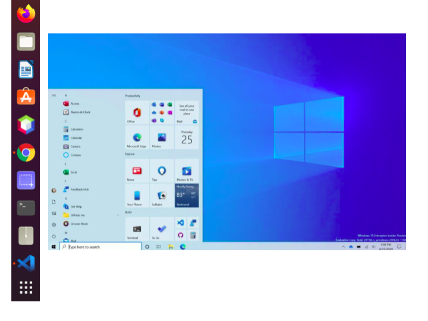
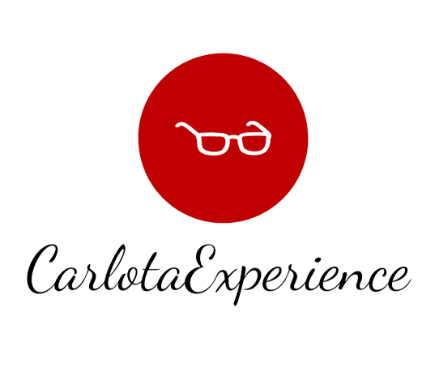
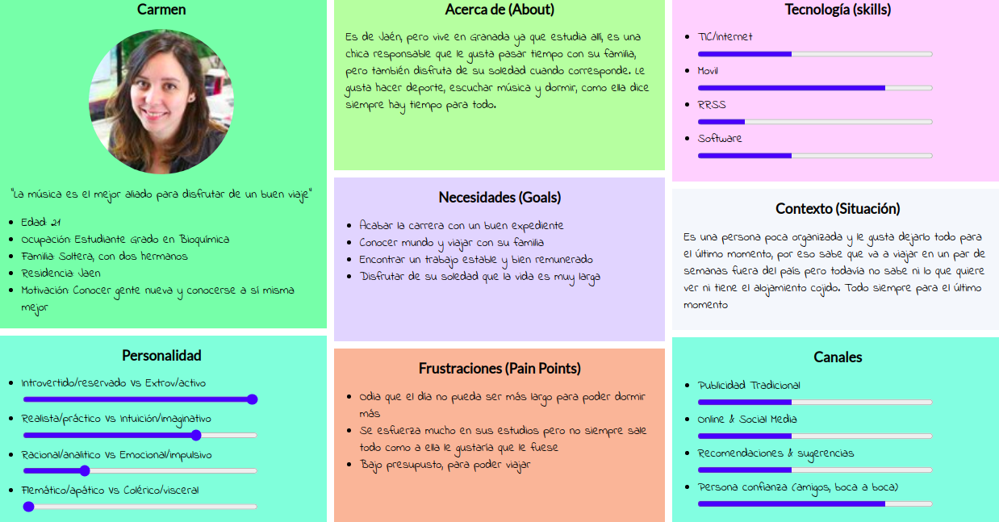
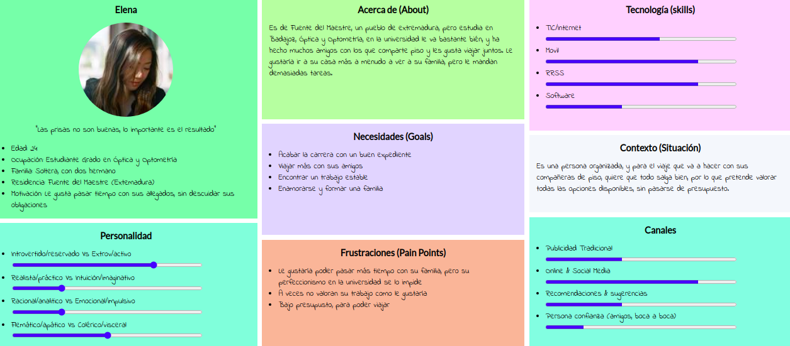
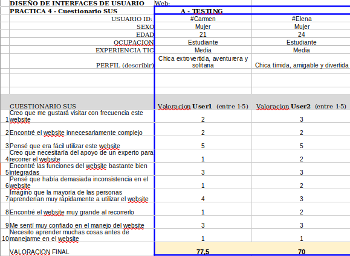

# Examen-DIU
## Parte 1: Mi experiencia UX
En esta asignatura he podido adquirir unos conocimientos y una experiencia que me han permitido ver lo que me rodea desde otra perspectiva. Ahora cada vez que veo cualquier página web o cualquier aplicación me hago preguntas del tipo ¿Por qué habrán elegido esta disposición de elementos? ¿Y esta paleta de colores? ¿Está página se adaptará a las distintas discapacidades que pueden tener sus usuarios?

Elementos que antes pasaban desapercibidos ahora marcan la diferencia entre una página y otra. He desarrollado un punto de vista crítico que antes no tenía.

### Clases de teoría, seminarios y actividades
Además he comprendido que elementos muy cotidicianos en mi vida a través de la pantalla no son tan sencillos como parecen ya que se deben regir según estándares de UI y/o UX que son el resultado de una larga evolución que no se pueden entender si no conocemos su
momento  dentro de la historia de la producción de interfaces de en el mundo del desarrollo software. 

Gracias a los ejercicios etnográficos me planteo que existen muchos estándares en nuestro día a día a los que no les prestamos demasiada atención, ¿Por qué los elementos más significativos de una web suelen resaltarse con colores vivos? ¿Por qué los botones de enviar de los servicios de mensajería siempre estan a la derecha? ¿Por qué el menú de Window esta en la parte de abajo de la pantalla y el de Linux en la zona lateral izquierda?

A este sentido crítico, de observación y cuestionamiento es al que me vengo refiriendo, estas preguntas que fluctúan en mi cabeza antes ni si quiera me las planteaba.

Otro punto que me ha llamado mucho la atención es todo lo realcionado con los aspectos de usabilidad y accesibilidad. Al tener que realizar actividades de estudio y comparación de páginas web he visto que muchas no se adaptan a las pautas WCAG, éstas tienen como fin ofrecer un estándar único y compartido que satisfaga las necesidades de las personas, organizaciones y gobiernos a nivel internacional. 

Además de que otras muchas ni si quieran se adaptan a las necesidades que puedan tener los usuarios en base a  sus discapacidades.

Una usabilidad correcta, eficiente y efectiva nos va permitir
la adaptación de nuestro servicio para que cumpla con una accesibilidad adecuada ya sea en términos legales o porjusticia.

### Clases prácticas
Por otro lado ahora vamos a centrarnos en lo que me han aportado las prácticas de DIU en mi experiencia UX.

Desde la primera práctica se nos ha pedido que valoremos un sitio web, en mi caso el hostel **Carlota Braum**, al autoobligarme a analizar un sitio que a simple vista es correcto, nos dimos cuenta que tenía errores y faltas de funcionalidad, y además al compararlo con otras web de funcionalidad similar vemos que tienen mucho donde mejorar.

Tener los elementos principales bien situados en la página central, no utilizar un texto escesivo ni tampoco escaso y la correcta combinación gráfica son puntos muy a tener en cuenta a la hora de diseñar nuestro sitio.

Posteriormente en el resto de prácticas tuvimos que diseñar desde 0 una nueva funcionalidad que se pudises aplicar a nuestro hostel.

Gracias al desarrollo de éstas , hemos podido profundizar un poco más en lo que conlleva la realización de una nueva funcionalidad para y un servicio ya definido. Hemos comprendido todo lo que esto implica, ya que lo principal es satisfacer las necesidades de los clientes para así poder atraerlos más a nuestro servicio principal (El hostel).

Como hemos visto se trata de un procedimiento cargado de detalles y con muchas etapas, pero todo muy necesario para concretar bien todas las características del nuevo servicio que queremos diseñar.

Además consideramos que gracias a los bocetos y posteriores Mockup hemos podido mejorar en otros apartados anteriores, ya que cuando de verdad nos ponemos a diseñar la funcionalidad, realmente nos damos cuenta de lo que realmente necesitamos, lo que realmente nos hace falta y a simple vista pasa desapercibido.

Hemos podido conocer el largo pero interesante proceso que conlleva el diseño completo de una interfaz con todo el trabajo que  tiene detrás y que pasa desapercibido, desde la elección de una adecuada paleta de colores al diseño de un buen logotipo o la elección de fuente correcta. 

Además de conocer los patrones de diseño que posteriormente tuvimos que aplicar en el diseño final de la aplicación.

Finalmente un aspecto positivo que me ha aportado la realización de la práctica, y aun que no tenga demasiado que ver con lo tratado hasta ahora, es que me ha permitido mejorar trabajando en equipo, en un primer momento no conocia de nada a mi compañero, nos conocimos ese mismo día, los dos estabamos solos y para una persona tan tímida como yo la primera práctica fue un reto enorme. 
Tener que coordinarme con alguien del que no sabía nada, sin embargo poco a poco descubrimos que haciamos un buen tandem y hemos podido sacar adelante todas las prácticas adaptandonos a nuestros diferentes horarios y a lo distintos que pareciamos en un primer momento.

### Conclusiones
Para finalizar y resaltar una vez lo dicho anteriormente gracias a la realización de esta asignatura, tanto en la parte teórica como en la práctica nos hemos podido poner en la piel de un diseñador de interfaces y hemos comprendido que esto no resulta una tarea sencilla, conlleva un gran esfuerzo y ser muy cuidadoso con todos los detalles para que el resultado final sea correcto.

Al mismo tiempo que desarrollábamos capacidades críticas de los sitios web que visitamos y de las aplicaciones que usamos diariamente. Gracias a ello  hemos aprendido a valorar el trabajo que requiere todo lo que nos rodea y que en la mayoría de los casos no lo sabemos valorar adecuadamente.

> Un sueño no se hace realidad por arte de magia; necesita sudo, determinación y trabajo duro. **_Colin Powelll_**

## PARTE II: Caso de estudio: App Tour ciudad Vs Free Tour App
En esta parte del examen vamos a realizar un caso de estudio sobre la app de cityme en comparación con una app clásica de Free tour llamada Guru Walk, para ello procedo a valorar las técnicas y metodologías de diseño centrado en el usuario y UX. He descargado la aplicación desde la tienda de app de mi móvil y vamos a realizar un seguimiento similar al realizado en las prácticas para valorar esta nueva funcionalidad.

## Paso 1. UX Desk Research & Analisis 

1.a Analisis de competitivad
----

En la siguiente tabla vamos a comprar, mediante la realización de un análisis, la app de **Guru walk** con la de **City me**. 

A continuación se comparan los productos ofrecidos por cada uno así como algunas funcionalidades de la aplicación mediante una tabla que contiene afirmaciones y negaciones así como algunas aclaraciones en los casos más ambiguos.

|  	 | [City me](https://cityme.eu/) | [Guru Walk](https://www.guruwalk.com/)    | 
| ------------- | -------- | ----------- | 
| Galería de imágenes | Si | Si |
| Perfil | Si | Si |
| Tutorial de la aplicación | Si | No |
| Catálogo de lugares  |Si, escaso 5 destinos | Si |
| Funcionalidades de pago | Si, casí todo| Si |
| Filtros por idioma | No | Si |
| Filtros por ciudad | No | Si |
| Filtros por horario | No | Si |
| Filtros por calidad | No | Si |
| Selector de idioma | Si, Español Inglés y Francés | NO |

1.b Personas imaginarias
-----

Se ha procedido a la creación de dos personas, Carmen y Elena, para analizar el perfil de posibles clientes de nuestra aplicación **City me** así como su actitud a la hora de ver si les ayudaría en la situación de que se encuentren visitando una ciudad de su guía.

### Carmen

Es un chica extrovertido que busca conocer a otra gente mientras se lo pasa bien disfrutando de sus aficiones, le gusta socializar y salir de su zona de confort.

### Elena

Elena es una chica tímida, muy comprometida con sus estudios, le gusta pasar tiempo con sus amigos, por lo que deciden irse un fin de semana de vacaciones juntas ahora que han acabado los exámenes.

## Paso 2. Analisis
2.a Usability Review
----

Los principales defectos que nos encontramos son la falta de funcionalidad que no sean de pago, ya que casi que no se pude realizar ninguna acción sin que tengamos que pagar. Otro aspecto en contra es el escaso catálogo de sitios que nos ofrece esta aplicación, solo 5.

Se ha obtenido una valoración general de **46** puntos sobre **100**.

2.b  Resultados de SUS 
----

A continuación se muestran los resultados obtenidos a partir del cuestionario SUS en base a la experiencia de las dos personas antes descritas

## Paso 3. Conclusiones

La aplicación Cityme es un poco escasa, aunque el diseño está muy bien resaltando los elementos más significativos y utilizando un buen diseño y paleta de colores.

Pienso que puede desarrollarse más y en un futuro si se corrigen errores e implementan más funcionalidades que no sean de pago podrá llegar a un amplio público
